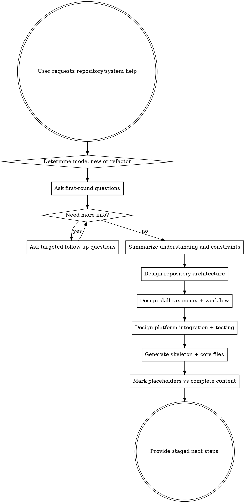

# Building Skill Systems

## Overview

Do not build a skill repository as a pile of prompts.

A strong skill repository is a **system**:
- it has an entry point
- it has a workflow
- it has clear layers
- it has platform integration
- it has verification
- it has room to evolve

**Core principle:** repository structure and workflow design come before file generation.

This skill helps you design or refactor a skill repository by:
1. gathering the right inputs through progressive questioning
2. defining repository architecture
3. defining the skill taxonomy and workflow
4. defining platform integration and testing strategy
5. generating a repository skeleton and core file drafts
6. clearly distinguishing complete content from placeholders

**Announce at start:** "I'm using the building-skill-systems skill to design this skill repository as a complete system."

---

## The Iron Law

```text
DO NOT GENERATE A SKILL SYSTEM BEFORE YOU UNDERSTAND ITS DOMAIN, USERS, PLATFORMS, AND WORKFLOW.
```

If you have not clarified the system requirements, you are not ready to design the repository.

If you have not designed the repository, you are not ready to generate files.

If you have not labeled what is complete vs placeholder, you are not ready to call it a starting point.

---

## When to Use

Use this skill when the user wants to:

- create a new skill repository
- build a domain-specific skill framework
- create a workflow-oriented multi-skill system
- turn scattered prompts into a real skill architecture
- refactor an existing skill repository
- define how skills, hooks, docs, tests, agents, and platform adapters fit together

This is a **repository-level architecture skill**.

### Do NOT use this skill when:
- the user only wants one skill written
- the user wants wording improvements to one prompt
- the repository architecture is already fixed and only one file needs content
- the task is purely implementation of an already-approved skill-system design

For single-skill work, use the repository's skill-authoring workflow.

---

## What This Skill Produces

This skill should leave the user with a **real system design**, not a vague brainstorm.

At minimum, produce:
- a skill-system brief
- repository architecture
- directory structure
- skill taxonomy
- workflow map
- platform integration strategy
- testing strategy
- initial file plan
- draft core files if requested

A good result should answer:
- what is this repository for?
- who is it for?
- how does it start?
- what are the core workflows?
- how are skills organized?
- how is it installed/integrated?
- how is it tested?
- what gets built now vs later?

---

## Default Design Bias

Unless the user explicitly asks for a smaller structure, bias toward a **complete skill-system repository** with explicit places for:

- `skills/`
- `agents/`
- `commands/`
- `hooks/`
- `docs/`
- `tests/`
- platform-specific integration files
- install/bootstrap docs
- maintenance scripts
- repository metadata and contribution docs

If a node is not immediately used, it may remain empty or placeholder-backed — but if it matters architecturally, it should still exist.

**Visible empty structure is better than hidden future chaos.**

---

## Two Modes

You MUST determine which mode applies before proceeding.

### Mode A: New Repository / Greenfield
Use when the user is creating a new skill repository from scratch.

Your job:
- gather requirements
- define architecture
- define workflows
- define structure
- draft core files

### Mode B: Existing Repository / Refactor
Use when the user already has a repository, skill pack, or prompt collection.

Your job:
- assess current structure
- identify architectural gaps
- define the target architecture
- create a staged migration plan
- preserve compatibility where appropriate
- draft bridging files, placeholders, or deprecation paths

---

## Questioning Strategy

Do **not** force the user to provide the entire repository contract in one message.

Default to **progressive questioning**:
- start with the smallest set of high-leverage questions
- ask follow-up questions only where the answers materially affect the architecture
- stop asking once the design inputs are sufficient
- summarize before moving into architecture

Only use a full questionnaire if the user explicitly prefers answering everything upfront.

A good experience should feel like guided design, not form filling.

---

## Progressive Questioning Rule

### Default behavior
Ask questions in **small rounds**.

Each round should usually contain **3-5 questions**, not a giant checklist.

### Follow-up behavior
Only ask the next round of questions based on:
- what the user already answered
- what is still missing
- what would change the architecture

### Stop condition
Stop asking questions when you can confidently determine:
- repository type
- target users
- target platforms
- workflow strictness
- generation scope
- required structural components
- whether this is new-build or refactor

Once you have these, move to summary and architecture.

### Full-questionnaire mode
Only switch to a full all-at-once questionnaire if the user explicitly asks for it.

---

## Recommended Opening

Use language like:

> "I’ll design this in steps so you don’t need to provide everything at once. I’ll start with the minimum questions needed to determine the repository shape, then I’ll only ask follow-ups where they affect the architecture."

---

## The Required Process

You MUST complete these phases in order.



Do not skip clarification because the pattern seems familiar.

Pattern familiarity is not repository understanding.

---

# Phase 1: First-Round Questions

## Purpose

The first round is not meant to collect everything.

It is only meant to determine the overall direction of the repository.

### Ask these first unless the user already answered them:

1. Is this a **new repository** or a **refactor of an existing one**?
2. What **domain or task area** is this skill system for?
3. Who are the **primary users**?
4. Do you want a **focused/lightweight skill pack** or a **complete workflow framework**?
5. Which **platforms** should it support first?

That is the default first-round question set.

Do not ask 15-20 questions up front unless the user explicitly wants that.

---

## Example First-Round Prompt

Use a pattern like:

> "I’ll start with the minimum questions needed to determine the repository shape:
> 1. Is this a new repository or a refactor?
> 2. What domain is it for?
> 3. Who will use it?
> 4. Do you want a lightweight skill pack or a full workflow framework?
> 5. Which platforms should it support first?"

---

# Phase 1.5: Targeted Follow-Up Questions

After the first round, only ask follow-up questions where the answers affect the structure.

### Common follow-up topics

#### If the user wants a full framework:
Ask:
- Should it include hooks?
- Should it include docs/specs/plans?
- Should it include tests?
- Should it include reviewer/agent roles?
- Should it include commands or compatibility layers?

#### If the user wants lightweight:
Ask:
- Which components should still exist as placeholders?
- Do you still want bootstrap/orientation?
- Do you still want test scaffolding, even if minimal?

#### If the user wants multi-platform support:
Ask:
- Must multi-platform support exist from day one?
- Do you want plugin manifests and install docs now, or only placeholder slots?
- Are tool mapping references needed now?

#### If the user says refactor:
Ask:
- What exists today?
- What feels broken or confusing?
- Do existing users depend on current names/paths?
- Is compatibility required during migration?

#### If the user requests generated drafts:
Ask:
- Architecture only, skeleton, or core file drafts?
- Keep empty future slots visible, yes or no?

---

## Follow-Up Question Rule

Do not ask follow-ups that do not affect architecture.

Examples of bad follow-ups too early:
- exact final wording of README marketing copy
- exact naming of every future subskill
- low-level release process details before structure is known

Ask only what changes:
- repository shape
- workflow
- integration
- testing
- generation scope

---

# Phase 1 Stop Condition

Stop asking questions once you can confidently determine:

- mode: new / refactor
- domain and repository purpose
- target users
- initial platform scope
- lightweight vs full framework
- required structural components
- generation scope
- major constraints

If you already know these, stop and move to summary.

Do not keep asking just because more questions are possible.

---

# Phase 1 Output Requirement

Before any design work, summarize your understanding in this exact structure:

```markdown
## Skill System Brief

**Mode:** New repository / Refactor existing repository

**Purpose:** ...
**Domain:** ...
**Target users:** ...
**Target platforms:** ...
**Repository scope:** focused skill pack / full workflow framework
**Workflow philosophy:** strict / mixed / lightweight
**Required structural components:** ...
**Optional structural components:** ...
**Generation scope for this pass:** ...
**Constraints:** ...
```

If needed, add:

```markdown
**Open decisions still being held as defaults:** ...
```

Then either:
- ask for confirmation, or
- proceed if the user already signaled you to continue with reasonable defaults

If contradictions exist, call them out immediately.

Do not design around unresolved contradictions.

---

# Phase 2: Repository Architecture

Once the brief is clear, design the repository as a product.

## Required Questions to Answer

You MUST define:
- what kind of repository this is
- which layers it needs
- which directories are active now
- which directories are placeholders
- what is intentionally omitted
- where bootstrap lives
- where docs live
- where tests live
- where platform-specific files live

---

## Strong Default Layout

Unless the user explicitly wants something lighter, bias toward a structure like:

```text
<repo-root>/
├── README.md
├── AGENTS.md
├── CLAUDE.md
├── GEMINI.md
├── LICENSE
├── CHANGELOG.md
├── package.json
├── .gitignore
├── .gitattributes
├── .version-bump.json
├── .github/
│   ├── PULL_REQUEST_TEMPLATE.md
│   └── ISSUE_TEMPLATE/
├── .claude-plugin/
│   ├── plugin.json
│   └── marketplace.json
├── .cursor-plugin/
│   └── plugin.json
├── .codex/
│   └── INSTALL.md
├── .opencode/
│   ├── INSTALL.md
│   └── plugins/
├── agents/
├── commands/
├── hooks/
├── docs/
│   ├── testing.md
│   ├── plans/
│   └── <system-name>/
│       ├── specs/
│       └── plans/
├── scripts/
├── skills/
└── tests/
```

---

## Architecture Output Requirement

You MUST produce:

### 1. Architectural style
Examples:
- skill-driven workflow framework
- domain-specific skill library
- policy-driven multi-platform skill system
- lightweight skill pack with future framework slots

### 2. Directory tree
Show the tree.

### 3. Directory purpose map
For each major directory:
- purpose
- required now or placeholder
- key files expected there

### 4. Omission map
If anything is intentionally omitted, state:
- what is omitted
- why
- what the consequence is

A repository with only `skills/` is usually under-designed.

A repository with many directories but no workflow is also under-designed.

Good architecture needs both:
- **structure**
- **flow**

---

# Phase 3: Skill Taxonomy and Workflow Design

A skill system is not just "some skills."

You MUST define both:
- **taxonomy**
- **flow**

---

## Required Skill Categories

Unless the domain strongly suggests another split, define these:

### 1. Bootstrap / Orientation
The system's entry point.

Examples:
- `using-<system-name>`
- `working-with-<domain>-skills`

### 2. Discovery / Framing
Pre-execution skills:
- brainstorming
- scoping
- triage
- intake
- diagnosis
- requirements gathering

### 3. Planning / Structuring
Turns goals into actionable work:
- writing-plans
- decomposition
- architecture planning
- review criteria generation

### 4. Execution
Performs the work:
- executing-plans
- domain-specific execution skills
- subagent workflows if supported

### 5. Quality / Verification
Maintains rigor:
- test-driven-development
- systematic-debugging
- verification-before-completion
- requesting-code-review
- receiving-code-review

### 6. Finish / Handoff
Handles completion:
- finishing workflows
- publishing workflows
- delivery/handoff skills

### 7. Meta / Maintenance
Helps evolve the repository itself:
- writing-skills
- building-skill-systems
- evaluating-skills
- migration/platform support skills

---

## Required Skill Matrix

You MUST produce a matrix like this:

```markdown
## Skill Matrix

| Skill | Role | Trigger | Produces | Comes Before | Comes After | Status |
|------|------|---------|----------|--------------|-------------|--------|
| using-<system> | bootstrap | session start / first relevant task | orientation | none | discovery/planning | draft |
| ... | ... | ... | ... | ... | ... | placeholder / draft / required now |
```

At minimum, include:
- bootstrap
- 2-4 core workflow skills
- 1 quality skill
- 1 meta skill if relevant

---

## Required Workflow Output

You MUST produce a concrete workflow model.

At minimum:
1. primary workflow
2. alternate branch(es)
3. minimum viable workflow

### Recommended primary workflow shape

```text
bootstrap
  -> discovery / clarification
    -> planning / structuring
      -> execution
        -> review / verification
          -> finish / handoff
```

If the domain differs, adapt — but do not omit the flow.

Do not just describe the workflow in prose.

Show it concretely:
- ordered list
- tree
- graph
- stage model

---

# Phase 4: Platform Integration Strategy

A skill repo is incomplete if the agent cannot reliably use it.

For each target platform, define:
- discovery mechanism
- bootstrap mechanism
- whether hooks are used
- whether manifests are used
- whether install docs are needed
- whether tool mapping docs are needed

---

## Required Platform Matrix

You MUST produce a matrix like this:

```markdown
## Platform Integration Matrix

| Platform | Discovery Method | Bootstrap Method | Required Files | Tool Mapping Needed | Status |
|----------|------------------|------------------|----------------|---------------------|--------|
| Claude Code | plugin/skills discovery | hook/context | ... | yes/no | required now |
| Cursor | ... | ... | ... | ... | placeholder / draft |
| Gemini CLI | ... | ... | ... | ... | ... |
```

If the user only targets one platform, still document that explicitly.

Do not leave platform support as implied.

---

# Phase 5: Testing and Verification Strategy

A strong skill system must be testable.

You MUST define:
- what gets tested
- where tests live
- fast vs slow tests
- automated vs manual checks
- what is built now vs staged later

---

## Required Test Categories

Recommend the relevant ones from:
- skill-triggering tests
- explicit-skill-request tests
- platform integration tests
- workflow tests
- feature/helper-script tests
- regression tests

---

## Required Testing Matrix

You MUST produce a matrix like this:

```markdown
## Testing Matrix

| Test Suite | Purpose | Scope | Fast/Slow | Required Now or Later | Notes |
|-----------|---------|-------|-----------|------------------------|-------|
| tests/skill-triggering | verify automatic activation | prompts -> expected skill | fast | required now | ... |
| tests/platform-x | verify bootstrap/integration | hooks/manifests | medium | later | ... |
```

Do not say "add tests later" without categorizing what is delayed and why.

If testing is deferred, say:
- which tests are deferred
- why
- what risk that creates
- when they should be added

---

# Phase 6: Generate Skeleton and Core Files

Only after the previous phases are complete should you generate artifacts.

---

## Required Generated Sections

You MUST produce:

### 1. Repository tree
A concrete directory tree.

### 2. File purpose summary
A short explanation of what each top-level or key file does.

### 3. Initial file set
A prioritized list of what should actually be created first.

### 4. Placeholder map
A clear distinction between:
- files that should be fully drafted now
- files that should be skeletal
- files that should exist but stay empty
- files intentionally postponed

---

## Required Placeholder Map

You MUST include a section like:

```markdown
## Placeholder vs Complete Content Map

### Complete or near-complete now
- README.md
- skills/using-<system>/SKILL.md
- ...

### Starter drafts now
- skills/<core-skill>/SKILL.md
- docs/testing.md
- ...

### Placeholder structure only
- agents/
- commands/
- tests/platform-x/
- ...

### Intentionally postponed
- ...
```

---

## If the user wants actual file drafts

Generate at least:
- `README.md`
- bootstrap skill draft
- 2-4 core workflow skill drafts or placeholders
- one docs skeleton
- one testing skeleton
- platform bootstrap/install files if relevant

Do not fabricate specificity you do not have.

If the domain specifics are not yet known, generate a strong scaffold and mark what still needs to be filled in.

---

# Required Final Output Template

When delivering the result, use this structure:

```markdown
# <System Name> Skill System Design

## 1. Skill System Brief
...

## 2. Architectural Style
...

## 3. Repository Structure
...

## 4. Directory Purpose Map
...

## 5. Skill Matrix
...

## 6. Workflow Design
...

## 7. Platform Integration Matrix
...

## 8. Testing Matrix
...

## 9. Initial File Set
...

## 10. Placeholder vs Complete Content Map
...

## 11. Recommended Next Steps
...
```

If file drafts are requested, append:

```markdown
## 12. Draft Files
- README.md
- skills/using-<system>/SKILL.md
- ...
```

Do not omit sections silently.

If a section is intentionally minimal, say so explicitly.

---

# Refactor Mode Addendum

If the user is refactoring an existing repository, you MUST also include:

```markdown
## Current-State Summary
...

## Gap Analysis
...

## Migration Stages
...

## Compatibility / Deprecation Plan
...
```

Do not only show the ideal future state.
The user also needs the bridge from current state to target state.

---

# Placeholder Discipline

Placeholders are acceptable.
Ambiguity is not.

## Good
- `agents/` exists for future reviewer roles, currently empty by design
- `commands/` retained for compatibility, currently minimal
- `tests/platform-y/` created as reserved structure for later harness integration

## Bad
- "TBD"
- "add some docs later"
- "might want hooks"
- "probably support more platforms eventually"
- "test this somehow"

If it matters structurally, make a decision now.

---

# Red Flags

If you catch yourself thinking any of these, STOP.

| Thought                                       | Reality                                                      |
| --------------------------------------------- | ------------------------------------------------------------ |
| "I'll just create some files to get momentum" | Momentum without structure creates cleanup debt.             |
| "The user wants speed, I'll skip questions"   | Fast wrong architecture is slower than slow good architecture. |
| "The domain is obvious"                       | Domain assumptions produce elegant nonsense.                 |
| "A directory tree is enough"                  | Trees without workflows are dead diagrams.                   |
| "A skill list is enough"                      | Skills without taxonomy and flow are disconnected assets.    |
| "Bootstrap can be added later"                | If the system has no entry path, it has no system behavior.  |
| "Testing is optional for now"                 | Unverified skill systems rot quickly.                        |
| "Cross-platform support can stay vague"       | Platform vagueness becomes integration failure later.        |
| "Placeholders let me defer the design"        | Good placeholders preserve decisions; bad ones hide indecision. |

---

# Common Rationalizations

| Excuse                                   | Reality                                                      |
| ---------------------------------------- | ------------------------------------------------------------ |
| "This is just scaffolding"               | Scaffolding sets future conventions.                         |
| "We'll reorganize when it's bigger"      | Reorg cost rises once users depend on names and paths.       |
| "README is enough bootstrap"             | Agents need explicit orientation paths.                      |
| "The tests can come after first release" | If deferred, record what and why — don't hand-wave.          |
| "We only need skills/"                   | Maybe. Prove it. Don't assume it.                            |
| "I already know the pattern"             | Knowing the pattern is not understanding this system's needs. |

---

# What Good Looks Like

A strong result from this skill should make these easy to answer:

- What is this system for?
- Who is it for?
- What is the first skill or bootstrap path?
- What is the primary workflow?
- Which platforms are supported and how?
- What tests exist or should exist?
- Which files are real now vs placeholders?
- What should the maintainer build next?

If those answers are not clear, the system is still incomplete.

---

# Minimum Viable Good Result

If time is tight, the minimum acceptable result is:

1. skill system brief
2. repository architecture
3. directory tree
4. directory purpose map
5. skill matrix
6. workflow design
7. platform integration matrix
8. testing matrix
9. initial file set
10. placeholder map
11. bootstrap skill draft
12. explicit next steps

Anything less is still exploration.

---

# Relationship to Other Skills

This skill designs the **system**.

It does not replace the process for writing excellent individual skills.

Use this skill to decide:
- what the repository contains
- how it is structured
- how skills fit together
- how it integrates with platforms
- how it is tested
- how it evolves

Use single-skill authoring workflows to write the individual skill contents well.

---

# Final Rule

```text
A skill repository is a product, not a folder.
Clarify first.
Architect second.
Generate third.
Label the truth clearly.
```

Do not confuse "some files exist" with "a skill system exists."